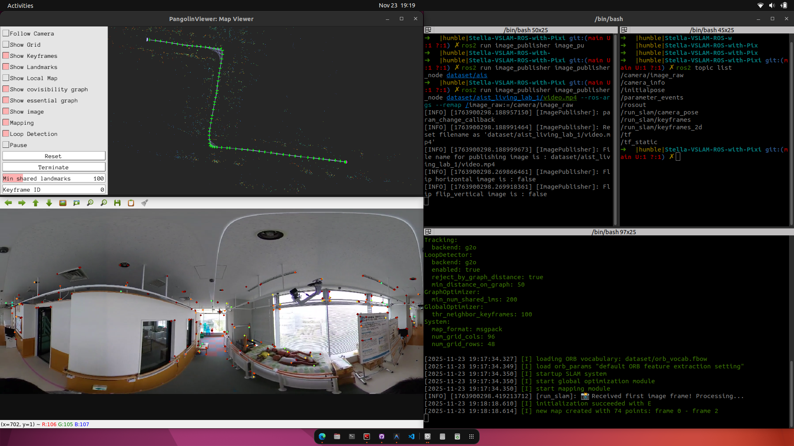

# 🗺️ Stella VSLAM with ROS 2 Humble (Pixi Environment)

**Stella VSLAM** is a modern Visual SLAM (Simultaneous Localization and Mapping) system that supports monocular, stereo, and RGB-D cameras. This repository provides a complete setup for building and running Stella VSLAM with **ROS 2 Humble** using **Pixi** for dependency management, eliminating the need for manual dependency installation.



### ✨ Features
- 🎯 **Modern SLAM**: Based on ORB-SLAM with improvements and active maintenance
- 🤖 **ROS 2 Integration**: Full ROS 2 Humble support with topic-based communication
- 📦 **Pixi Environment**: Reproducible builds with isolated dependencies
- 🎮 **Multiple Viewers**: Support for Pangolin, Iridescence, and Socket viewers
- 🌐 **Multiple Camera Models**: Perspective, Fisheye, Equirectangular support


---

## 📋 Prerequisites

- **OS**: Linux (tested on Ubuntu 22.04)
- **Pixi**: [Install Pixi](https://pixi.sh/)

---

## 🚀 Quick Start

### 1️⃣ Setup Environment

```bash
pixi install
```

### 2️⃣ Build Stella VSLAM & ROS 2 Wrapper

```bash
pixi run bash scripts/build-stella.sh
```

### 3️⃣ Download Example Dataset

```bash
bash scripts/download-stella-example.sh
```

### 4️⃣ Verify Build

```bash
bash scripts/check-stella-ros.sh
```

---

## 🎮 Running Examples

### 🤖 ROS 2 Example (With Pangolin Viewer)

#### Terminal 1: Image Publisher
```bash
pixi shell
source ros2_ws/install/setup.bash
ros2 run image_publisher image_publisher_node dataset/aist_living_lab_1/video.mp4 --ros-args --remap /image_raw:=/camera/image_raw
```

#### Terminal 2: SLAM Node
```bash
pixi shell
source ros2_ws/install/setup.bash
ros2 run stella_vslam_ros run_slam -v dataset/orb_vocab.fbow -c lib/stella_vslam/example/aist/equirectangular.yaml --map-db-out map.msg --viewer pangolin_viewer --ros-args -p publish_tf:=false
```

#### Terminal 2 (Localization Mode):
```bash
pixi shell
source ros2_ws/install/setup.bash
ros2 run stella_vslam_ros run_slam --disable-mapping -v dataset/orb_vocab.fbow -c lib/stella_vslam/example/aist/equirectangular.yaml --map-db-in map.msg --viewer pangolin_viewer --ros-args -p publish_tf:=false
```

### 📡 ROS 2 Topics
```
/camera/image_raw           # Input image
/run_slam/camera_pose       # Camera pose (Odometry)
/run_slam/keyframes         # Keyframes
/tf                         # Transform tree
```

---

### ⚡ Non-ROS Example (Direct Video Processing)

Run SLAM directly without ROS middleware:

```bash
bash scripts/run-stella-simple.sh
```

This script automatically:
- Clones & builds `stella_vslam_examples`
- Runs `run_video_slam` with Pangolin Viewer

### 🧩 ROS 2 Composable (Intra-Process, Zero-Copy Friendly)
All nodes run in a single process to avoid DDS serialization (faster for large videos).

1) Terminal 1: Run component container with intra-process communication
```bash
pixi shell
source ros2_ws/install/setup.bash
ros2 run rclcpp_components component_container_mt \
  --ros-args -r __node:=slam_container -p use_intra_process_comms:=true
```

2) Terminal 2: Load video publisher (adjust video path if needed)
```bash
pixi shell
source ros2_ws/install/setup.bash
ros2 component load /slam_container stella_vslam_ros stella_vslam_ros::VideoPublisher \
  --node-name video_pub \
  --param video_path:=dataset/aist_living_lab_1/video.mp4 \
  --param topic:=camera/image_raw \
  --param frame_id:=camera \
  --param fps:=0.0 \
  --param loop:=true
```

3) Terminal 3: Load SLAM with Pangolin
```bash
pixi shell
source ros2_ws/install/setup.bash
ros2 component load /slam_container stella_vslam_ros stella_vslam_ros::System \
  --node-name run_slam \
  --param vocab_file_path:=dataset/orb_vocab.fbow \
  --param setting_file_path:=lib/stella_vslam/example/aist/equirectangular.yaml \
  --param map_db_path_out:=map.msg \
  --param viewer:=pangolin_viewer \
  --param publish_tf:=false \
  --param encoding:=bgr8 \
  --param qos_reliability:=reliable
```

Pangolin will appear; this pipeline uses intra-process communications to avoid copy/serialization between processes.

---

## ⚙️ Command-Line Arguments

### For `run_video_slam` (Non-ROS)
```
-h, --help                  produce help message
-v, --vocab arg             vocabulary file path
-m, --video arg             video file path
-c, --config arg            config file path
--mask arg                  mask image path
--frame-skip arg (=1)       interval of frame skip
--no-sleep                  not wait for next frame in real time
--auto-term                 automatically terminate the viewer
--log-level arg (=info)     log level (trace, debug, info, warn, err, critical, off)
--map-db-in arg             load a map from this path
--map-db-out arg            store a map database at this path after SLAM
--disable-mapping           disable mapping module
--temporal-mapping          enable temporal mapping
```

### For `run_slam` (ROS 2)
```
-v, --vocab arg             vocabulary file path
-c, --config arg            config file path
--mask arg                  mask image path
--map-db-in arg             load a map from this path
--map-db-out arg            store a map database at this path after SLAM
--disable-mapping           disable mapping module
--temporal-mapping          enable temporal mapping
--viewer arg                viewer type (pangolin_viewer, iridescence_viewer, socket_publisher, none)
--log-level arg (=info)     log level

ROS 2 Parameters:
--ros-args -p publish_tf:=<true|false>              publish TF transforms
--ros-args -p odom_frame:=<frame_name>              odometry frame name
--ros-args -p map_frame:=<frame_name>               map frame name
--ros-args -p camera_frame:=<frame_name>            camera frame name
```

---

## 📁 Project Structure

```
stella-vslam-ros/
├── dataset/                    # Example datasets
│   ├── orb_vocab.fbow
│   └── aist_living_lab_1/
├── lib/                        # Built libraries
│   ├── stella_vslam/
│   ├── pangolin_viewer/
│   └── stella_vslam_examples/
├── ros2_ws/                    # ROS 2 workspace
│   └── src/stella_vslam_ros/
├── scripts/
│   ├── build-stella.sh         # Build script
│   ├── download-stella-example.sh
│   ├── check-stella-ros.sh
│   └── run-stella-simple.sh
└── pixi.toml                   # Pixi configuration
```

---

## 🛠️ Troubleshooting

### Build Fails
```bash
rm -rf .pixi lib ros2_ws pixi.lock
pixi install
pixi run bash scripts/build-stella.sh
```

### Viewer Not Showing
- Make sure you're running in a desktop environment with GUI support
- Check that the `--viewer pangolin_viewer` flag is included

---

## 📚 References

- [Stella VSLAM](https://github.com/stella-cv/stella_vslam)
- [Stella VSLAM ROS](https://github.com/stella-cv/stella_vslam_ros)
- [Pixi Package Manager](https://pixi.sh/)
